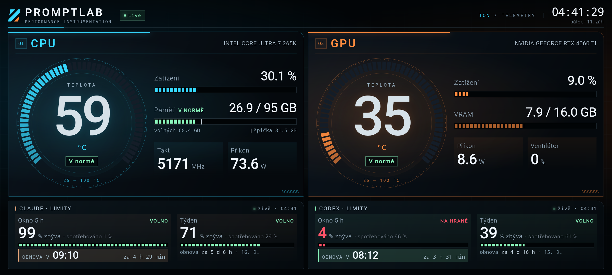

# HA Panel

**Tablet na zdi jako panel pro Home Assistant.** Velká čísla čitelná přes
pokoj, stav vždycky barvou **i slovem**, černé pozadí kvůli OLED.

V tomhle repozitáři jsou tři věci, které jdou používat každá zvlášť:

| Část | Co to je | Kam patří |
|---|---|---|
| **Karta pro Lovelace** | `custom:ha-panel-card` — stejné budíky uvnitř dashboardu Home Assistantu | do HA přes HACS nebo ručně |
| **Balíček a blueprinty** | pomocníci pro ovládání tabletu a hotové automatizace | do konfigurace HA |
| **Aplikace HA Panel** | Android aplikace pro tablet: celá obrazovka, buzení pohybem, vlastní editor entit | do tabletu (Android Studio) |



---

## 1) Karta pro Lovelace

### Instalace přes HACS

1. HACS → ⋮ vpravo nahoře → **Vlastní repozitáře** (*Custom repositories*)
2. URL `https://github.com/joshuaaaaa/HA-repo`, typ **Dashboard** (*Lovelace/Plugin*)
3. Najdi **HA Panel** v seznamu a dej **Stáhnout**
4. Obnov stránku (Ctrl+F5)

Pokud by se karta nenašla, přidej zdroj ručně: *Nastavení → Dashboardy → ⋮ →
Zdroje → Přidat*, adresa `/hacsfiles/HA-repo/ha-panel-card.js`, typ
**Modul JavaScriptu**.

### Instalace bez HACS

1. Stáhni [`dist/ha-panel-card.js`](dist/ha-panel-card.js) a ulož ho do
   `config/www/ha-panel-card.js`
2. *Nastavení → Dashboardy → ⋮ → Zdroje → Přidat*: `/local/ha-panel-card.js`,
   typ **Modul JavaScriptu**
3. Obnov stránku

### Nastavení karty

Do dashboardu přidej ruční kartu (*Přidat kartu → Ruční*) a vlož:

```yaml
type: custom:ha-panel-card
title: DŮM                # prázdné = jen hodiny a stav
subtitle: ''
clock: true               # hodiny v záhlaví

sections:                 # hlavní hodnoty, nejvýš šest
  - name: OBÝVÁK
    code: T1              # zkratka v rámečku
    tone: cyan            # cyan | amber | green | violet | red
    view: gauge           # gauge (budík) | bar (sloupec) | graph (křivka) | number
    entity: sensor.obyvak_teplota
    caption: Teplota      # popisek nad číslem
    min: 0                # rozsah budíku i sloupce
    max: 35
    levels:               # hodnota → slovo a barva
      - { to: 18, tone: info,     label: Chladno }
      - { to: 24, tone: good,     label: Příjemno }
      - { to: 28, tone: warning,  label: Teplo }
      - { tone: critical, label: Horko }        # poslední bez "to" = zbytek
    meters:               # ukazatele s pruhem vedle budíku
      - { entity: sensor.obyvak_vlhkost, name: Vlhkost, min: 0, max: 100 }
    tiles:                # malé hodnoty pod ukazateli
      - { entity: sensor.co2, name: 'CO₂', view: graph, hours: 6 }

  - name: VENKU           # druhá sekce jako křivka
    code: T2
    tone: amber
    view: graph
    hours: 12             # kolik hodin zpět (1 až 72)
    entity: sensor.venku_teplota

panels:                   # řady dlaždic dole, nejvýš čtyři panely
  - name: Světla
    tone: amber
    items:
      - { entity: light.kuchyne, name: Kuchyně }
      - { entity: light.loznice, name: Ložnice }
      - { entity: sensor.tablet_baterie, name: Tablet, view: bar, min: 0, max: 100 }
```

Nejkratší možná karta vypadá takhle — zbytek si karta domyslí podle druhu
čidla (rozsah budíku, stupně i popisek):

```yaml
type: custom:ha-panel-card
sections:
  - { name: OBÝVÁK, entity: sensor.obyvak_teplota }
```

**Volby sekce:** `name`, `code`, `tone`, `view`, `hours`, `entity`, `attribute`,
`caption`, `unit`, `decimals`, `min`, `max`, `levels`, `meters`, `tiles`.
**Volby dlaždice** (v `meters`, `tiles` i `items`): `entity`, `name`, `unit`,
`attribute`, `decimals`, `view` (`value` / `bar` / `graph`), `hours`, `min`,
`max`, `levels`, `tap` (`auto` / `none` / `toggle`). Starší zápis `bar: true`
platí dál a znamená totéž co `view: bar`.

**Jak se hodnota kreslí (`view`):**

| Hodnota | Sekce | Dlaždice |
|---|---|---|
| `gauge` | velký budík s obloukem (výchozí) | — |
| `bar` | svislý sloupec vedle čísla | pruh pod hodnotou |
| `graph` | křivka za posledních `hours` hodin | malá křivka pod hodnotou |
| `number` | jen velké číslo | výchozí (`value`) |

Křivku kreslí karta z historie Home Assistanta (`history/history_during_period`)
a mezi načteními ji dokresluje z živých změn stavu. Svislý rozsah se řídí
naměřenými hodnotami — krajní hodnoty jsou napsané u okraje grafu.

**Klepnutí:** světlo, zásuvka, přepínač, scéna, skript, žaluzie, zámek a
přehrávač se rovnou přepnou; u čidla se otevře obvyklé okno s podrobnostmi.

**Stupně (`levels`)** jsou to, co dělá panel čitelným přes pokoj: `tone` nese
barvu, `label` slovo. Barva sama o sobě nestačí — přes pokoj splývá a část
lidí ji nerozliší vůbec. Stupně: `good`, `warning`, `serious`, `critical`,
`info`, `idle`.

Rozvržení vyexportované z aplikace (editor → *Celek* → záloha) jde do karty
vložit rovnou:

```yaml
type: custom:ha-panel-card
layout: { … JSON z aplikace … }
```

---

## 2) Balíček a blueprinty

### Pomocníci pro ovládání tabletu

[`homeassistant/packages/ha_panel.yaml`](homeassistant/packages/ha_panel.yaml)
vytvoří přepínač displeje a číslo pro jas. Aplikace je poslouchá, takže
panel jde z automatizací zhasnout i rozsvítit. Návod je v hlavičce souboru
(nebo si oba pomocníky naklikej v *Nastavení → Zařízení a služby → Pomocníci*).

### Blueprinty

Importují se odkazem: *Nastavení → Automatizace a scény → Blueprinty →
Importovat blueprint* a vlož URL.

| Blueprint | Co dělá | URL k importu |
|---|---|---|
| Pohyb u panelu rozsvítí světlo | tablet vidí pohyb → světlo; po odchodu zhasne | [`pohyb-u-panelu.yaml`](blueprints/automation/ha_panel/pohyb-u-panelu.yaml) |
| Noční režim panelu | večer panel zhasne, ráno rozsvítí a nastaví denní jas | [`panel-nocni-rezim.yaml`](blueprints/automation/ha_panel/panel-nocni-rezim.yaml) |
| Hlídání baterie tabletu | baterie pod mezí a nenabíjí se → tvoje akce | [`baterie-tabletu.yaml`](blueprints/automation/ha_panel/baterie-tabletu.yaml) |

Do pole URL patří adresa souboru na GitHubu, například:
`https://github.com/joshuaaaaa/HA-repo/blob/main/blueprints/automation/ha_panel/pohyb-u-panelu.yaml`

---

## 3) Aplikace pro tablet

Aplikace **není doplněk Home Assistantu** — add-ony jsou kontejnery běžící
uvnitř HA, kdežto tohle je Android aplikace, která se instaluje do tabletu.
S Home Assistantem se spojí sama přes **dlouhodobý přístupový token**.

Proti kartě v Lovelace umí navíc to, co prohlížeč neumí:

- celá obrazovka bez lišt, tlačítko zpět nezavírá, start po zapnutí tabletu,
- **buzení pohybem** — přední kamera jako čidlo (ze snímku se čte jen jas,
  obraz nikam neodchází),
- klidový režim s velkými hodinami a ochranou displeje proti vypálení,
- zhasínání a jas podle denní doby, světelného čidla nebo příkazu z HA,
- **výběr entit přímo na displeji** — ozubené kolo otevře editor,
- hlášení stavu tabletu do HA (baterie, osvětlení, pohyb, displej).

Sestavení: otevři složku [`android/`](android/) v Android Studiu a dej **Run**.
Projekt nemá jedinou knihovnu, minSdk 24.

**Celý návod včetně tokenu, nastavení a řešení problémů:
[docs/ha-panel.md](docs/ha-panel.md)**

---

## Vývoj

Karta i aplikace stojí na týchž zdrojích v
`android/app/src/main/assets/` — proto se nemůžou rozejít ve vzhledu ani ve
způsobu, jakým počítají stupně. Soubor `dist/ha-panel-card.js` je **sestavený**,
needituje se ručně:

```bash
node tools/build-card.mjs          # sestaví dist/ha-panel-card.js
node tools/build-card.mjs --check  # jen ověří, že je dist aktuální

node tests/hapanel-util.cjs        # čísla, slova, stupně
node tests/hapanel-layout.cjs      # rozvržení a jeho kontrola
node tests/hapanel-ws.cjs          # spojení s HA: přihlášení, výpadky, služby
node tests/hapanel-history.cjs     # historie pro křivky
node tests/card-browser.mjs        # karta v prohlížeči (potřebuje Playwright)
```

Panel jde vyzkoušet i bez tabletu: naservíruj
`android/app/src/main/assets/` jakýmkoli statickým serverem a otevři
`index.html` — tlačítko *Ukázat, jak to vypadá* ukáže panel bez Home
Assistanta.

## Licence

MIT — viz [LICENSE](LICENSE).
