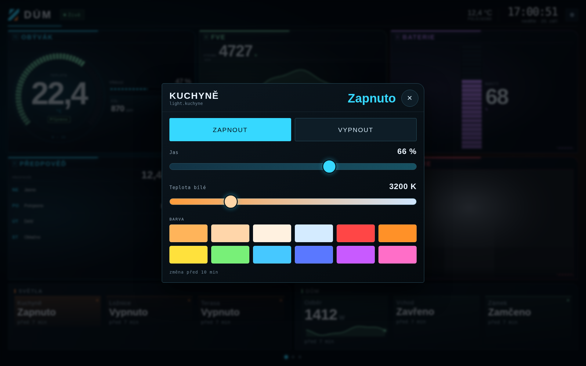

# HA Panel

**Tablet na zdi jako panel pro Home Assistant.** Velká čísla čitelná přes
pokoj, stav vždycky barvou **i slovem**, černé pozadí kvůli OLED.


*Skutečný snímek panelu (obraz z kamery je v ukázce zástupný).*

V repozitáři jsou tři části, každá použitelná zvlášť:

| Část | Co to je | Kam patří |
|---|---|---|
| **Karta pro Lovelace** | `custom:ha-panel-card` — stejné budíky uvnitř dashboardu Home Assistantu | do HA přes HACS nebo ručně |
| **Balíček a blueprinty** | pomocníci pro ovládání tabletu a hotové automatizace | do konfigurace HA |
| **Aplikace HA Panel** | Android aplikace pro tablet: celá obrazovka, buzení pohybem, ovládání světel, editor přímo na displeji | do tabletu (Android Studio) |

## Co panel umí

- **Osm způsobů, jak ukázat hodnotu:** budík, sloupec, křivka se stupnicemi,
  velké číslo, **kamera**, **předpověď počasí**, **kalendář** a **seznam úkolů**.
- **Ovládání z panelu:** klepnutí přepne světlo nebo zásuvku, dlouhý stisk
  otevře okno s jasem, teplotou bílé a barvou; umí i žaluzie, zámky,
  termostat, přehrávač, výběr z možností a alarm.
- **Až pět stránek**, mezi kterými se přejíždí prstem.
- **Zvonek u dveří:** když čidlo naskočí, panel se probudí a ukáže kameru
  přes celou obrazovku.
- **Editor přímo na displeji** — entity se vybírají ze seznamu z Home
  Assistanta, sekce se přejmenovávají, mřížka se nastavuje.
- **Klidový režim** s hodinami, buzení pohybem z kamery a ochrana OLED.



---

## 1) Karta pro Lovelace

### Instalace přes HACS

1. HACS → ⋮ vpravo nahoře → **Vlastní repozitáře** (*Custom repositories*)
2. URL `https://github.com/joshuaaaaa/HA-repo`, typ **Dashboard** (*Lovelace/Plugin*)
3. Najdi **HA Panel** v seznamu a dej **Stáhnout**
4. Obnov stránku (Ctrl+F5)

Pokud by se karta nenašla, přidej zdroj ručně: *Nastavení → Dashboardy → ⋮ →
Zdroje → Přidat*, adresa `/hacsfiles/HA-repo/ha-panel-card.js`, typ
**Modul JavaScriptu**.

### Instalace bez HACS

1. Stáhni [`dist/ha-panel-card.js`](dist/ha-panel-card.js) do `config/www/`
2. *Nastavení → Dashboardy → ⋮ → Zdroje → Přidat*: `/local/ha-panel-card.js`,
   typ **Modul JavaScriptu**
3. Obnov stránku

### Nastavení karty

Nejkratší možná karta — zbytek si karta domyslí podle druhu čidla (rozsah
budíku, stupně i popisek):

```yaml
type: custom:ha-panel-card
sections:
  - { name: OBÝVÁK, entity: sensor.obyvak_teplota }
```

A celá se vším všudy:

```yaml
type: custom:ha-panel-card
title: DŮM                # prázdné = jen hodiny a stav
weather: weather.dum      # teplota a stav vedle hodin
clock: true
columns: 3                # kolik sekcí na řádek (0/vynechat = automaticky)
rows: 2                   # kolik řad sekcí
panel_columns: 2          # kolik panelů na řádek

sections:
  - name: OBÝVÁK
    code: T1              # zkratka v rámečku
    tone: cyan            # cyan | amber | green | violet | red
    view: gauge           # jak se hodnota kreslí (tabulka níž)
    entity: sensor.obyvak_teplota
    caption: Teplota
    min: 0
    max: 35
    levels:               # hodnota → slovo a barva
      - { to: 18, tone: info,    label: Chladno }
      - { to: 24, tone: good,    label: Příjemno }
      - { to: 28, tone: warning, label: Teplo }
      - { tone: critical, label: Horko }          # poslední bez "to" = zbytek
    meters:               # ukazatele vedle hlavní hodnoty
      - { entity: sensor.obyvak_vlhkost, name: Vlhkost, min: 0, max: 100 }
    tiles:                # malé hodnoty pod ukazateli
      - { entity: sensor.co2, name: 'CO₂', view: graph, hours: 6 }

  - { name: FVE, code: W, tone: green, view: graph, hours: 12, entity: sensor.fve }
  - { name: PŘEDPOVĚĎ, tone: cyan, view: forecast, count: 4, entity: weather.dum }
  - { name: NÁKUP, tone: amber, view: todo, count: 5, entity: todo.nakup }
  - { name: KALENDÁŘ, tone: violet, view: calendar, count: 5, days: 7, entity: calendar.rodina }
  - { name: DVEŘE, tone: red, view: camera, refresh: 10, entity: camera.dvere }

panels:                   # řady dlaždic dole, nejvýš čtyři
  - name: Světla
    tone: amber
    items:
      - { entity: light.kuchyne, name: Kuchyně }
      - { entity: light.loznice, name: Ložnice, tap: detail }
      - { entity: sensor.tablet_baterie, name: Tablet, view: bar, min: 0, max: 100 }
      - { entity: camera.garaz, name: Garáž, view: camera }
```

**Jak se hodnota kreslí (`view`):**

| Hodnota | Sekce | Dlaždice |
|---|---|---|
| `gauge` | velký budík s obloukem (výchozí) | — |
| `bar` | svislý sloupec vedle čísla | pruh pod hodnotou |
| `graph` | křivka za posledních `hours` hodin, se stupnicemi | malá křivka |
| `number` | jen velké číslo | výchozí (`value`) |
| `camera` | obraz z kamery, sám se obnovuje (`refresh:` v s) | náhled kamery |
| `forecast` | předpověď na `count` dní z entity `weather.*` | — |
| `calendar` | nejbližší události z `calendar.*` (`days:` dopředu) | — |
| `todo` | otevřené položky z `todo.*`, klepnutím se odškrtnou | — |

**Volby sekce:** `name`, `code`, `tone`, `view`, `hours`, `refresh`, `count`,
`days`, `entity`, `attribute`, `caption`, `unit`, `decimals`, `min`, `max`,
`levels`, `meters`, `tiles`.
**Volby dlaždice** (v `meters`, `tiles` i `items`): `entity`, `name`, `unit`,
`attribute`, `decimals`, `view`, `hours`, `min`, `max`, `levels`, `tap`
(`auto` / `none` / `toggle` / `detail`). Starší zápis `bar: true` platí dál.

**Klepnutí:** světlo, zásuvka, přepínač, scéna, skript, žaluzie, zámek a
přehrávač se rovnou přepnou; u čidla se otevře okno s podrobnostmi.
**Dlouhý stisk** otevře okno Home Assistanta s plným ovládáním.

**Stupně (`levels`)** jsou to, co dělá panel čitelným přes pokoj: `tone` nese
barvu, `label` slovo. Barva sama nestačí — přes pokoj splývá a část lidí ji
nerozliší. Stupně: `good`, `warning`, `serious`, `critical`, `info`, `idle`.

Rozvržení vyexportované z aplikace jde do karty vložit rovnou:

```yaml
type: custom:ha-panel-card
layout: { … JSON z aplikace … }
```

---

## 2) Balíček a blueprinty

[`homeassistant/packages/ha_panel.yaml`](homeassistant/packages/ha_panel.yaml)
vytvoří přepínač displeje a číslo pro jas — aplikace je poslouchá, takže
panel jde z automatizací zhasnout i rozsvítit. Návod je v hlavičce souboru
(nebo si oba pomocníky naklikej v *Nastavení → Zařízení a služby → Pomocníci*).

Blueprinty se importují odkazem: *Nastavení → Automatizace a scény →
Blueprinty → Importovat blueprint*.

| Blueprint | Co dělá |
|---|---|
| [Pohyb u panelu rozsvítí světlo](blueprints/automation/ha_panel/pohyb-u-panelu.yaml) | tablet vidí pohyb → světlo; po odchodu zhasne |
| [Noční režim panelu](blueprints/automation/ha_panel/panel-nocni-rezim.yaml) | večer panel zhasne, ráno rozsvítí a nastaví jas |
| [Hlídání baterie tabletu](blueprints/automation/ha_panel/baterie-tabletu.yaml) | baterie pod mezí a nenabíjí se → tvoje akce |

Do pole URL patří adresa souboru na GitHubu, například:
`https://github.com/joshuaaaaa/HA-repo/blob/main/blueprints/automation/ha_panel/pohyb-u-panelu.yaml`

---

## 3) Aplikace pro tablet

Aplikace **není doplněk Home Assistantu** — add-ony jsou kontejnery běžící
uvnitř HA, kdežto tohle je Android aplikace do tabletu. S Home Assistantem
se spojí sama přes **dlouhodobý přístupový token**.

Proti kartě v Lovelace umí navíc to, co prohlížeč neumí:

- celá obrazovka bez lišt, tlačítko zpět nezavírá, start po zapnutí tabletu,
- **buzení pohybem** — přední kamera jako čidlo (ze snímku se čte jen jas,
  obraz nikam neodchází),
- klidový režim s velkými hodinami a ochranou displeje proti vypálení,
- zhasínání a jas podle denní doby, světelného čidla nebo příkazu z HA,
- **výběr entit přímo na displeji** — ozubené kolo otevře editor,
- hlášení stavu tabletu do HA (baterie, osvětlení, pohyb, displej).

Sestavení: otevři složku [`android/`](android/) v Android Studiu a dej **Run**.
Projekt nemá jedinou knihovnu, minSdk 24.

**Celý návod včetně tokenu, nastavení a řešení problémů:
[docs/ha-panel.md](docs/ha-panel.md)**

---

## Vývoj

Karta i aplikace stojí na týchž zdrojích v `android/app/src/main/assets/`,
takže se nemůžou rozejít ve vzhledu ani ve výpočtu stupňů. Soubor
`dist/ha-panel-card.js` je **sestavený**, needituje se ručně:

```bash
node tools/build-card.mjs          # sestaví dist/ha-panel-card.js
node tools/build-card.mjs --check  # jen ověří, že je dist aktuální

node tests/hapanel-util.cjs        # čísla, slova, stupně
node tests/hapanel-layout.cjs      # rozvržení, stránky, kontrola vstupu
node tests/hapanel-ws.cjs          # spojení s HA: přihlášení, výpadky, služby
node tests/hapanel-history.cjs     # historie pro křivky

# v prohlížeči (potřebují Playwright: npm i -g playwright)
node tests/card-browser.mjs        # karta proti falešnému hass
node tests/control-browser.mjs     # ovládání, okno s jasem, zoom, stupnice
node tests/pages-browser.mjs       # stránky, přejíždění prstem, zvonek
node tests/feeds-browser.mjs       # předpověď, kalendář, úkoly, kamery
node tests/zoom-browser.mjs        # zvětšení sekce a ovládání ve velkém
```

Panel jde vyzkoušet i bez tabletu: naservíruj `android/app/src/main/assets/`
jakýmkoli statickým serverem a otevři `index.html` — tlačítko *Ukázat, jak to
vypadá* ukáže panel bez Home Assistanta.

## Licence

MIT — viz [LICENSE](LICENSE).
