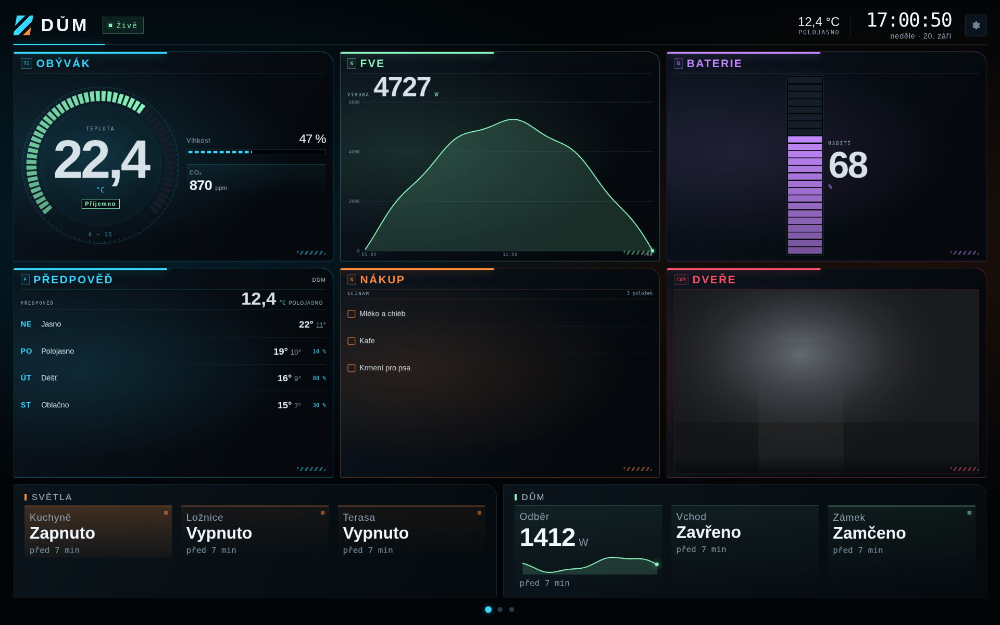

# HA Panel — tablet na zdi jako panel pro Home Assistant

Tenhle návod je o **aplikaci pro tablet**. Karta pro Lovelace, balíček
s pomocníky a blueprinty mají svůj popis v [README](../README.md).

Aplikace si data bere z **Home Assistanta** přes dlouhodobý přístupový
token, entity si vybíráš sám a sekce si pojmenuješ po svém. Na obrazovce
nezůstal žádný název ani značka — jen hodiny, hodnoty a stav spojení.

Vzhled je záměrně stejný jako u původní přístrojové desky: velká čísla
čitelná přes pokoj, stav vždy **barvou i slovem**, černé pozadí kvůli OLED.


*(rozvržení je takové, obsah si určuješ sám)*

---

## Co panel umí

- **Čte Home Assistant živě** přes WebSocket — změna stavu je na displeji
  hned, panel se serveru na nic neptá dokola.
- **Výběr entit přímo v panelu**: ozubené kolo vpravo nahoře otevře editor,
  entity se hledají v seznamu, který přišel z Home Assistanta.
- **Přejmenování sekcí a dlaždic**, vlastní jednotky, rozsah budíku,
  desetinná místa a **stupně** (do kolika platí které slovo a barva).
- **Ovládání klepnutím**: světla, zásuvky, scény, žaluzie, zámky a přepínače
  jdou z panelu rovnou přepnout.
- **Stránky**: až pět, přejíždí se mezi nimi prstem.
- **Kamery, předpověď, kalendář a úkoly** rovnou v panelu — bez vlastní
  aplikace a bez otevírání Home Assistanta.
- **Klidový režim**, když před tabletem nikdo není: velké hodiny, dvě
  hodnoty a pomalu plující obraz kvůli vypalování displeje.
- **Probuzení pohybem** — přední kamera hlídá, jestli se něco hnulo, a
  rozsvítí displej dřív, než na něj sáhneš.
- **Hlášení stavu tabletu do Home Assistanta**: baterie, osvětlení, pohyb
  a stav displeje jako běžné entity pro automatizace.
- **Ovládání tabletu z Home Assistanta**: přepínačem zhasneš panel, číslem
  nastavíš jas.
- **Kiosek**: celá obrazovka bez lišt, tlačítko zpět nezavírá, start po
  zapnutí tabletu, volitelný PIN k nastavení.

Funkčně je to totéž, co od panelu čekáš podle
[kiosk-mode](https://github.com/NemesisRE/kiosk-mode) — ten doplněk schovává
v Lovelace hlavičku a postranní panel. Tady není co schovávat: panel je
vlastní obrazovka, žádné ovládací prvky Home Assistanta na ní nejsou.
Zbytek (probouzení pohybem, spořič, řízení displeje z automatizací) dělá
aplikace sama.

---

## Rychlý start

1. **Vytvoř token** v Home Assistantu (viz níže).
2. **Otevři složku `android/`** v Android Studiu, nech doběhnout Gradle a
   dej **Run** na připojený tablet.
3. Při prvním spuštění se otevře **nastavení**: vlož adresu a token,
   klepni na *Vyzkoušet spojení* a ulož.
4. Panel si **sám sestaví první rozvržení** z tvých teplot, vlhkostí,
   baterií a světel.
5. Ozubeným kolem otevři **editor** a uprav si ho.

### Token (dlouhodobý přístupový token)

V Home Assistantu klikni vlevo dole na **své jméno** → záložka
**Zabezpečení** → úplně dole **Dlouhodobé přístupové tokeny** →
**Vytvořit token**. Pojmenuj si ho třeba „Tablet v kuchyni“. Vypsaný
řetězec se ukáže **jen jednou** — zkopíruj ho rovnou do tabletu (nebo si ho
pošli do schránky).

Adresu piš i s portem, tak jak ji zadáváš v prohlížeči:
`http://homeassistant.local:8123` nebo `http://192.168.1.10:8123`.
Pevná IP adresa je na tabletu spolehlivější než `.local`.

---

## Sestavení v Android Studiu

```
File → Open → vyber složku  android
```

Projekt je obyčejný Gradle projekt bez jediné knihovny (žádné AndroidX,
žádné závislosti ke stažení navíc):

| | |
|---|---|
| minSdk | 24 (Android 7) |
| targetSdk / compileSdk | 34 |
| Jazyk | Java 17 |
| Velikost APK | desítky kB |

Podepsané APK pro trvalou instalaci: **Build → Generate Signed App Bundle /
APK → APK**. Při instalaci přes `Run` se aplikace jmenuje `HA Panel` a má
příponu `.debug` v názvu balíčku, takže vedle sebe můžou běžet ostrá i
zkušební verze.

---

## Nastavení aplikace

Otevře se dlouhým stiskem **levého horního rohu** panelu, tlačítkem v
editoru (*Celek → Otevřít nastavení aplikace*) nebo automaticky při prvním
spuštění. Když si nastavíš PIN, chce ho panel pokaždé.

### Zdroj panelu
- **Home Assistant** — vestavěný panel (výchozí).
- **Vlastní adresa** — WebView načte libovolnou stránku, například původní
  telemetrii z počítače (`http://192.168.1.10:8099/`). Hodí se, když chceš
  na tabletu nechat starý dashboard.

### Displej a probouzení

| Volba | Co dělá |
|---|---|
| **Klidový režim po (s)** | Po této nečinnosti panel přejde na hodiny a dvě hodnoty. Výchozí 120 s. |
| **Zhasnout po (s)** | Po této nečinnosti displej zhasne. Výchozí 300 s. |
| **Jas ve dne / v noci (%)** | Noc je 22:00–7:00. |
| **Budit kamerou** | Detekce pohybu před tabletem (viz níže). |
| **Kameru zapínat jen při zhasnutém displeji** | Šetří proud a teplotu. Když panel svítí, stačí dotyk. |
| **Citlivost pohybu 1–10** | Vyšší číslo = reaguje i na menší pohyb. Při falešných probuzeních sniž. |
| **Budit přiblížením ruky** | Použije čidlo přiblížení (má ho skoro každý tablet i telefon). |
| **Jas podle světelného čidla** | Plynule mezi nočním a denním jasem podle okolního světla. |
| **Opravdu zhasnout displej** | Displej zhasne úplně. Vyžaduje správce zařízení a kamera pak hlídat nemůže — viz níže. |

### Kiosek

| Volba | Co dělá |
|---|---|
| **Spustit po startu systému** | Po zapnutí tabletu naskočí panel sám. |
| **Otočení obrazovky** | Podle senzoru / na šířku / na výšku. Panel umí obě orientace a v obou vyplní celou plochu displeje — rozvržení se přizpůsobí poměru stran tabletu, ať je 16:9, 16:10 nebo 4:3. |
| **PIN k nastavení** | Prázdné = bez zámku. Jinak se nastavení bez PINu neotevře. |
| **Hlásit stav tabletu** | Vytvoří v Home Assistantu čidla tabletu. |
| **Název zařízení** | Z něj se odvodí názvy entit: „Panel v kuchyni“ → `sensor.panel_v_kuchyni_baterie`. |

**Zkopírovat nastavení** dá celé nastavení i s tokenem do schránky —
na druhém tabletu stačí **Vložit nastavení ze schránky**.

---

## Úprava panelu (editor)

Ozubené kolo vpravo nahoře. Dokud neklepneš na **Uložit**, běží panel dál
podle starého nastavení.

### Stránky
Panel může mít **až pět stránek** a mezi nimi se **přejíždí prstem** —
vlevo/vpravo, jako mezi plochami na telefonu. Dole jsou tečky, které
ukazují, kde jsi, a dají se i zmáčknout. Každá stránka má vlastní sekce,
panely i rozložení, takže jedna může být domov, druhá kamery a třetí
energie.

Stránky se přidávají a přejmenovávají nahoře na záložkách *Sekce* i
*Panely* (blok **Stránky panelu**); šipkami ◀ ▶ se mění jejich pořadí.
Po odchodu od tabletu (klidový režim) se panel sám vrátí na první
stránku, takže po návratu vždycky začínáš doma.

### Sekce
Hlavní hodnota s ukazateli vedle. Panel unese **šest sekcí** — čím víc jich
je, tím menší okna; o tom rozhoduješ ty.

**Rozložení sekcí** je nahoře na téže záložce: *Sekcí na řádek* (automaticky
nebo 1–4) a *Počet řad* (automaticky nebo 1–3). Automaticky se sekce
poskládají podle svého počtu (1–3 vedle sebe, při více řádcích 2×2 nebo 3×2).
**Pořadí** sekcí v seznamu určuje, kam se která postaví — mění se šipkami
▲▼ u názvu sekce. Písmo a budíky uvnitř se vždy přepočítají podle toho, jak
velké okno doopravdy vyšlo, takže i malá sekce zůstane čitelná.

Totéž má i spodní řada: na záložce *Panely* se nastavuje *Panelů na řádek*.

- **Zobrazení** — jak se hodnota kreslí:

  | Volba | Co uvidíš |
  |---|---|
  | **Budík** | velký oblouk se segmenty a číslem uprostřed (výchozí) |
  | **Sloupec** | svislý sloupec vedle čísla — stejné čtení jako budík, míň místa |
  | **Graf (křivka)** | průběh za posledních 1–72 hodin se stupnicemi: hodnoty vlevo na kulatých číslech, časy dole |
  | **Jen číslo** | velké číslo bez rozsahu — pro veličiny, kde žádný rozsah nedává smysl |
  | **Kamera (snímek)** | obraz z kamery, který se sám obnovuje (výchozí po 10 s) |
  | **Předpověď počasí** | několik dní dopředu z entity `weather.*` — den, ikona, nejvyšší a nejnižší teplota |
  | **Kalendář** | nejbližší události z jednoho nebo více kalendářů („dnes 18:30“, „zítra“, jinak datum) |
  | **Seznam úkolů** | nesplněné úkoly ze seznamu; klepnutím na řádek se úkol odškrtne |

U předpovědi, kalendáře i seznamu úkolů se nastavuje, **kolik řádků** se
vejde do okna; u předpovědi navíc **na kolik dní** dopředu. Hodnoty si panel
nechává posílat z Home Assistanta sám (předpověď a úkoly přihlášením k
odběru, kalendář dotazem každých deset minut), takže se drží živé, aniž by
se server ptal dokola.

- **Entita budíku** — hlavní hodnota. Po výběru se rozsah, popisek i stupně
  doplní podle druhu čidla (teplota, vlhkost, baterie, CO₂, prach…).
- **Budík od / do** — rozsah, po kterém segmenty obíhají (u křivky se
  svislý rozsah řídí naměřenými hodnotami, takže se nenastavuje).
- **Křivka za** — jak dlouhé okno historie graf ukazuje.
- **Stupně** — řádek říká „do téhle hodnoty platí tohle slovo a barva“.
  Poslední řádek bez čísla platí pro všechno nad. Slovo je důležitější než
  barva: přes pokoj se barvy pletou a část lidí je nerozliší vůbec.
- **Ukazatele** — až čtyři řádky vedle hlavní hodnoty.
- **Dlaždice** — až šest malých hodnot pod ukazateli.

U ukazatele i dlaždice se vybírá **Zobrazení**: *Jen hodnota*, *Pruh*
(s vlastním rozsahem), *Křivka* (malý graf pod číslem) nebo *Kamera*
(malý náhled z `camera.*` místo čísla).

### Panely
Řada dlaždic dole, až osm v jednom panelu, **čtyři panely vedle sebe**.
U každé dlaždice se nastavuje **Zobrazení** a co má dělat **klepnutí**:

- *Podle druhu entity* (výchozí) — světlo, zásuvka, přepínač a ventilátor
  se přepnou, scéna a skript spustí, žaluzie otevře/zavře, zámek odemkne,
  přehrávač pauzne. U čidla se otevře okno s podrobnostmi.
- *Nic* — dlaždice jen ukazuje.
- *Přepnout* — vynutí `toggle`.
- *Okno s ovládáním* — rovnou otevře okno (níž).

U sekce stačí klepnutí: rozbalí se přes celou obrazovku a ovládání je
rovnou pod ní (viz *Zvětšení sekce*).

**Dlouhý stisk (0,6 s) otevře okno s ovládáním u každé dlaždice i sekce**,
ať je klepnutí nastavené jakkoli — stejný zvyk jako v Home Assistantu.

### Okno s ovládáním

Co okno nabídne, se řídí druhem entity:

| Entita | Co v okně je |
|---|---|
| **Světlo** | Zapnout/Vypnout, **jas**, **teplota bílé** (když ji světlo umí) a dvanáct **barev** |
| **Zásuvka, přepínač, siréna** | Zapnout / Vypnout |
| **Ventilátor** | Zapnout/Vypnout a otáčky |
| **Žaluzie / roleta** | Otevřít, Stop, Zavřít a poloha v procentech |
| **Zámek** | Zamknout / Odemknout |
| **Přehrávač** | obal alba a název toho, co hraje, Přehrát/Pauza, hlasitost, předchozí a další |
| **Termostat** | Cílová teplota po půl stupních a režimy (Topit, Chladit, Auto…) |
| **Scéna, skript** | Spustit |
| **Vysavač** | Uklidit, Do doku |
| **Výběr** (`select`, `input_select`) | seznam možností, klepnutím se přepne |
| **Číslo** (`number`, `input_number`) | posuvník v rozsahu entity i s krokem |
| **Alarm** | Zapnout doma, Zapnout mimo dům, Vypnout (vypnutí chce kód, když ho ústředna žádá) |
| **Čidlo** | hodnota, křivka za posledních 6 hodin a kdy se naposledy změnila |

Posuvníky posílají hodnotu **až po puštění prstu** — jinak by každé
škubnutí poslalo příkaz a světlo by blikalo. Okno se zavírá křížkem nebo
klepnutím mimo ně.

### Kamera

Sekce se zobrazením **Kamera** ukazuje snímek z entity `camera.*`; totéž
se vejde i do dlaždice v panelu jako malý náhled. Klepnutím se náhled
zvětší přes celou obrazovku. Panel
schválně netahá proud videa — na levném tabletu by ujídal baterku i paměť
— ale snímek si podle nastavení sám obnovuje (2 až 120 s). Adresu i s
přístupovým tokenem posílá Home Assistant v atributu entity, takže se nic
dalšího nenastavuje. Když je displej zhasnutý nebo je stránka schovaná,
snímky se netahají vůbec.

### Zvonek u dveří

V editoru *Celek → Zvonek u dveří* vybereš **čidlo** (tlačítko zvonku,
pohyb u dveří) a **kameru**. Když čidlo naskočí, panel se probudí a ukáže
kameru přes celou obrazovku; po nastavené době (výchozí 30 s) se sám
vrátí tam, kde byl. Zavřít to jde i dřív křížkem.

Hodí se to i na jiné věci než zvonek — třeba na kameru u garáže spuštěnou
pohybem.

### Zvětšení sekce

**Klepnutí na sekci** ji rozbalí přes celou obrazovku — okno vyjede
z místa, kde sekce stojí, a při zavření se tam zase vrátí, takže je
pořád vidět, co se odkud zvětšilo. Ve velkém běží dál živě (včetně
křivky) a zavírá se křížkem nebo klepnutím vedle.

Když je hlavní hodnota sekce **něco, co jde ovládat** (světlo, zásuvka,
roleta, termostat…), objeví se pod zvětšenou sekcí rovnou **ovládání** —
stejné, jaké má okno s podrobnostmi: zapnout, vypnout, jas, barva.
U čidla zůstane pruh prázdný, protože není co přepínat.

Ve zvětšené sekci schválně není záhlaví s hodinami a odznakem spojení —
to je vidět na panelu pod ní.

### Klid
Co je vidět v klidovém režimu: **až čtyři velké kruhy** s hodnotami a až tři
řádky pod nimi.

*Co ukazovat* má dvě polohy:

- **Hlavní hodnoty ze sekcí** (výchozí) — klidový režim sám převezme hlavní
  hodnotu prvních čtyř sekcí i s jejich stupni. Po přidání sekce se tedy
  objeví i na uspaném tabletu, aniž bys cokoli nastavoval.
- **Vlastní výběr** — vybereš si kruhy sám, včetně pořadí (šipky ▲▼).

Dlouhý název entity se uvnitř kruhu zkrátí, podtržítka se nahradí mezerami
a větší číslo si samo zmenší písmo, takže se popisky ani hodnoty nepřekrývají
s kruhy vedle.
Tady se taky nastavuje **pruh upozornění** — když vybraná entita naskočí do
zvoleného stavu, přes záhlaví přejede pruh (pračka dopere, otevřená vrata,
poplach). Když je hodnota číslo 0–100, ukáže se jako postup.

### Celek
Název a podtitulek panelu (**prázdné = v záhlaví zůstanou jen hodiny**),
**počasí v záhlaví** (nepovinná entita `weather.*` — vedle hodin se ukáže
teplota venku a slovo o stavu),
ovládání z Home Assistanta, záloha rozvržení jako JSON a tlačítko
**Sestavit z mých entit**, které rozvržení postaví znovu podle toho, co v
Home Assistantu je.

---

## Probouzení pohybem (kamera)

Přední kamera se používá jako čidlo pohybu, ne jako kamera:

1. Ze snímku se čte jen **jasová složka**.
2. Zmenší se na mřížku **16 × 12 políček** (192 čísel).
3. Porovná se s předchozím snímkem. Když se dost políček změní dost
   výrazně, je to pohyb a displej se rozsvítí.

**Co se s obrazem neděje:** nikam se neposílá, neukládá ani nezobrazuje.
Z každého snímku zbyde 192 čísel, která hned přepíše další snímek.
Aplikace nemá oprávnění k síti pro nic jiného než Home Assistant a kamera
je otevřená jen tehdy, kdy je detekce potřeba (ve výchozím nastavení jen
při zhasnutém displeji).

Bez povolení kamery funguje všechno ostatní dál — panel se pak budí dotykem,
přiblížením ruky nebo příkazem z Home Assistanta.

**Falešná probuzení?** Sniž citlivost. Kamera vidí i změnu světla (mraky,
rozsvícení v pokoji), takže na parapetu s ostrým sluncem je rozumná
citlivost 2–4.

### Zhasínání displeje

Android obyčejné aplikaci nedovolí displej vypnout. Panel to řeší dvěma
způsoby:

1. **Útlum (výchozí, bez oprávnění)** — jas jde na nulu a přes obsah lehne
   černá plocha. Na OLED je to k nerozeznání od zhasnutého displeje a
   systém po svém časovém limitu zhasne úplně. První dotyk do černé plochy
   panel jen probudí — nic omylem nepřepne.
2. **Opravdové zhasnutí** — v nastavení *Povolit správce zařízení*. Pak
   displej zhasne okamžitě. Jediná vyžádaná pravomoc je „zhasnout displej“
   (force-lock), nic jiného aplikace se správou zařízení nedělá.

   **Pozor na kameru:** se zhasnutým displejem není aplikace v popředí a
   Android jí kameru zabere — pohyb tedy panel nehlídá. Probudí ho
   mávnutí rukou nad čidlem přiblížení, tlačítko zapnutí nebo příkaz z
   Home Assistanta. Když chceš budit kamerou, nech výchozí útlum: na OLED
   vypadá stejně a systém displej po svém limitu stejně zhasne.

---

## Co panel hlásí do Home Assistanta

Při zapnutém *Hlásit stav tabletu* vzniknou (název podle *Názvu zařízení*):

| Entita | Co obsahuje |
|---|---|
| `sensor.<název>_baterie` | nabití v %, v atributech `charging` a `uptime_min` |
| `sensor.<název>_osvetleni` | okolní světlo v luxech |
| `binary_sensor.<název>_pohyb` | pohyb před tabletem |
| `binary_sensor.<název>_displej` | jestli displej svítí |

Hlásí se každou minutu a navíc hned při změně pohybu nebo stavu displeje.

> **Pozor:** stavy zapsané přes REST nejsou trvalé entity. Po restartu
> Home Assistanta na chvíli zmizí a vrátí se při nejbližším hlášení
> (do minuty).

### Příklad: rozsviť chodbu, když panel uvidí pohyb

```yaml
automation:
  - alias: Pohyb u panelu rozsvítí chodbu
    trigger:
      - platform: state
        entity_id: binary_sensor.panel_v_kuchyni_pohyb
        to: "on"
    condition:
      - condition: sun
        after: sunset
    action:
      - service: light.turn_on
        target: { entity_id: light.chodba }
```

---

## Ovládání tabletu z Home Assistanta

V Home Assistantu si vytvoř pomocníky (**Nastavení → Zařízení a služby →
Pomocníci**):

- **Přepínač** (`input_boolean.panel_displej`) — zapnuto svítí, vypnuto
  zhasne.
- **Číslo** (`input_number.panel_jas`, rozsah 1–100) — jas panelu.

Pak je v editoru přiřaď v *Celek → Ovládání z Home Assistantu*.

```yaml
automation:
  - alias: V noci panel zhasni
    trigger:
      - platform: time
        at: "23:00:00"
    action:
      - service: input_boolean.turn_off
        target: { entity_id: input_boolean.panel_displej }

  - alias: Ráno panel rozsviť
    trigger:
      - platform: time
        at: "06:30:00"
    action:
      - service: input_boolean.turn_on
        target: { entity_id: input_boolean.panel_displej }
      - service: input_number.set_value
        target: { entity_id: input_number.panel_jas }
        data: { value: 80 }
```

Po startu tabletu panel přepínač přečte, ale **sám se podle něj nezhasne** —
jinak by tablet po restartu zhasnul dřív, než by ho kdo viděl.

---

## Kiosek: aby se z panelu nedalo odejít

- Tlačítko **zpět** nic nedělá, systémové lišty jsou schované.
- **Start po zapnutí tabletu**: na Androidu 10 a novějším potřebuje
  aplikace navíc oprávnění **„Zobrazovat přes ostatní aplikace“** — systém
  jinak spuštění z pozadí zahodí. Odkaz na tu obrazovku je dole v nastavení
  (klepni na řádek s verzí).
- **Tablet jako domovská obrazovka**: aplikace se hlásí i jako launcher.
  V *Nastavení → Aplikace → Výchozí aplikace → Domovská aplikace* vyber
  HA Panel a tlačítko domů bude vracet do panelu.
- **PIN** zamkne nastavení, takže si host ani dítě nastavení neotevře.
- Zachranný východ, kdyby se panel nenačetl: **dlouhý stisk levého horního
  rohu** otevře nastavení vždycky.

---

## Soukromí a bezpečnost

- Token je uložený v soukromých datech aplikace (`SharedPreferences`),
  nikam se neodesílá a používá se jen proti tvé adrese Home Assistanta.
- Stránka panelu běží z `file:///android_asset/` uvnitř aplikace — není
  odkud ji podstrčit. Most do aplikace (`Panel`) má jen pár metod:
  nastavení, řízení displeje, haptika a údaje o tabletu.
- WebSocket je zvolený i kvůli tomu, že se při něm nekontroluje původ
  stránky (CORS), takže panel nepotřebuje žádné povolování na straně
  Home Assistanta.
- Kamera: viz výše — z obrazu nikdy nic neopustí paměť zařízení.
- Provoz po síti je nešifrovaný, pokud má Home Assistant `http://`. V
  domácí síti to obvykle stačí; přes internet používej `https://`
  (panel pak sám přepne na `wss://`).

---

## Když něco nehraje

| Co vidíš | Co s tím |
|---|---|
| **Token neplatí** | Token se v Home Assistantu ukazuje jen jednou — vytvoř nový a vlož ho znovu, bez mezer. |
| **Home Assistant neodpovídá** | Zkontroluj adresu i port v nastavení (*Vyzkoušet spojení*). Tablet a Home Assistant musí být ve stejné síti. |
| **Panel je prázdný** | Ozubené kolo → *Celek* → *Sestavit z mých entit*, nebo si sekce přidej ručně. |
| **Dlaždice ukazuje „—“** | Entita v Home Assistantu neexistuje nebo je `unavailable`. Pod dlaždicí je napsáno, kdy se naposledy změnila. |
| **Panel se budí sám** | Sniž citlivost pohybu, nebo kameru vypni a nech jen dotyk a čidlo přiblížení. |
| **Panel nenaskočí po restartu** | Povol „Zobrazovat přes ostatní aplikace“ (odkaz dole v nastavení). |
| **Displej nezhasne úplně** | Zapni *Opravdu zhasnout displej* a povol správce zařízení. |
| **Nejde otevřít nastavení** | Dlouhý stisk levého horního rohu. Při zapnutém PINu se zeptá na PIN. |

---

## Soubory

```
android/
├─ settings.gradle, build.gradle          projekt pro Android Studio
└─ app/
   ├─ build.gradle
   └─ src/main/
      ├─ AndroidManifest.xml
      ├─ java/cz/promptlab/hapanel/
      │  ├─ MainActivity.java      kiosek, přítomnost, most do stránky
      │  ├─ MotionDetector.java    pohyb z kamery (rozdíl jasu)
      │  ├─ ScreenManager.java     jas, útlum, zhasnutí, probuzení
      │  ├─ DeviceReporter.java    čidla tabletu do Home Assistanta
      │  ├─ HaClient.java          REST (ověření tokenu, zápis stavů)
      │  ├─ SetupActivity.java     nastavení
      │  ├─ Config.java            uložené nastavení + záloha
      │  ├─ BootReceiver.java      start po zapnutí
      │  ├─ AdminReceiver.java     správce zařízení (jen force-lock)
      │  └─ RetryClient.java       opakované načtení stránky
      ├─ res/                      motiv, ikona, obrazovka nastavení
      └─ assets/
         ├─ index.html             kostra panelu
         ├─ css/panel.css          vzhled panelu
         ├─ css/editor.css         vzhled editoru
         └─ js/
            ├─ util.js             čísla, slova, stupně
            ├─ layout.js           rozvržení a jeho kontrola
            ├─ ha.js               WebSocket klient Home Assistanta
            ├─ history.js          průběh hodnot pro křivky
            ├─ feeds.js            předpověď, kalendář a úkoly
            ├─ dialog.js           okno s ovládáním entity
            ├─ render.js           stavba obrazovky a vazby na entity
            ├─ editor.js           editor a výběr entit
            └─ app.js              slepení celku, režimy, klidový režim
```

Testy stránky běží v Node bez prohlížeče:

```
node tests/hapanel-util.cjs
node tests/hapanel-layout.cjs
node tests/hapanel-ws.cjs
node tests/hapanel-history.cjs
node tests/control-browser.mjs   # ovládání v prohlížeči (potřebuje Playwright)
node tests/pages-browser.mjs     # stránky, přejíždění, kamera, zvonek
node tests/feeds-browser.mjs     # předpověď, kalendář, úkoly, kamery
node tests/zoom-browser.mjs      # zvětšení sekce, ovládání ve velkém, písmo editoru
node tests/card-browser.mjs      # karta do Lovelace
```
